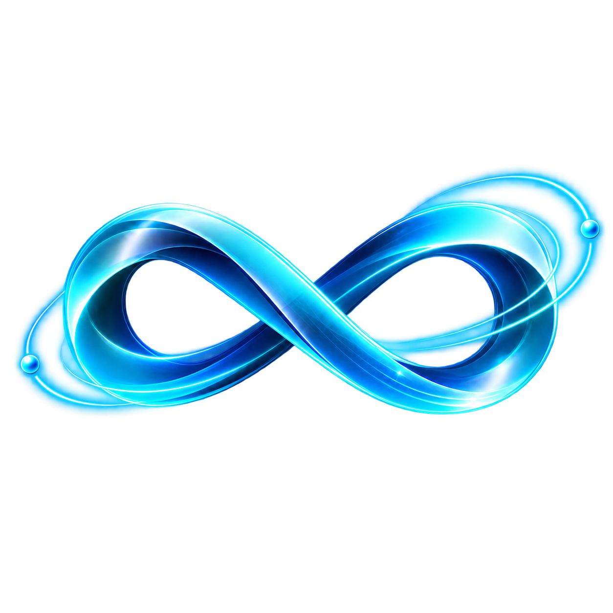

<div align="center">



# Motus.Market

### A market where every offer lives inside a move.

*Work here doesn't float free. Before you can offer a service, someone has to have made a move —
a real, public, dated statement of something they are trying to do. Every offer answers one.*

**Move The Mindset · Move The World · Build Your MotusMind · Make Your $Money Move**

[**Live**](https://www.motus.market) · [**The Spec**](spec.md) · [**Architecture**](docs/ARCHITECTURE.md) · [**Security model**](docs/SECURITY-MODEL.md) · [**Design system**](neoglass.md)

built by [Initium.Builders](https://github.com/InitiumBuilders) · part of the [MotusMoves](https://www.motusmoves.us) ecosystem

</div>

---

## What this is

Motus.Market is the marketplace layer of the Motus ecosystem. It is a **static front end** — four
HTML files, one stylesheet, one logo — that reads and writes live data through the public
MotusMoves.US API. There is no build step, no bundler, no framework, and no server of its own.

That is a deliberate constraint, not a shortcut. The whole interface is legible in a text editor,
loads in one request per file, and can be served by anything that can serve a folder.

## The law of this market

> **A service cannot exist on its own.**

Everywhere else, a marketplace is a list of sellers shouting into a void. Here, the unit is the
**MotusMove** — a public statement of intent, made on MotusMoves.US. An offer is always *attached
to* a move. You cannot list a service without first choosing the move it answers.

The effect is that supply is pulled into existence by stated need, and every piece of completed
work is permanently legible as *the thing that answered this*.

## The four rails

| Rail | What it is |
|---|---|
| **$DASH** | A priced offer, paid in Dash. |
| **$TRUST** | A priced offer, paid in $TRUST on Intuition. |
| **VotusMove** | Given freely. Tips in $TRUST are welcome, but the mover earns **$VOTUS** for moving without a fee. |
| **MOTUS** | Not a currency you buy. It is minted 1:1 against paid work and event presence — a record of what you actually did. |

`$VOTUS` here means *earned-by-giving* and enters the market only that way. It is a different thing
from purchased AI credit elsewhere in the ecosystem; the spec is explicit about the distinction.

## The five surfaces

| Tab | What lives there |
|---|---|
| **Market** | Every MotusMove — broadcasting now, last 24h, last 7d, all time, and *your own*. Open any move to see the offers inside it, or add one. |
| **!MOTUS** | The MotusModels Commons — named, runnable patterns that pay **Source · Roots · Network** on every run. Your own models and the one you're currently running. |
| **Agents** | The agent registry. |
| **Loops** | LearningLoops, LaunchLoops, LeverageLoops — the LongLoops, with MotusModels as the keystone. |
| **Corpus** | Sign in with your MotusMoves account. Your profile, your credits, and the **MotusCorpus** — one synced record of everything you have moved, on either platform. |

## Files

```
index.html      the landing page — statement cinema, one line per viewport
app.html        the application — all five surfaces, the rail, the sheets
hope.html       The Founding Exchange (see the note below)
read.html       a glass markdown reader for the documents in this repo
assets/
  neoglass.css  NEURONEOGLASS — the whole design system, one file
  logo.png      the mark
spec.md         the product specification
neoglass.md     the design system, written out
notes-*.md      the design studies this interface was built from
clarity-tips.md ten moves toward clarity
docs/           architecture, security model, and how releases work
```

## Run it

There is nothing to install.

```bash
git clone https://github.com/InitiumBuilders/Motus.Market.git
cd Motus.Market
python3 -m http.server 8080
```

Then open `http://localhost:8080`. The app will read live data from the public MotusMoves.US API.

Serving from a folder root matters: `read.html` fetches its documents from `/`, and the pages link
to each other by absolute path.

## How it talks to the ecosystem

Every endpoint below is public, read-only unless stated, and CORS-open.

| Endpoint | Purpose |
|---|---|
| `GET /api/feed` | Every MotusMove. |
| `GET /api/models` | The MotusModels Commons, plus aggregate stats. |
| `GET /api/profile?slug=` | One public MotusMover profile. Bare: the whole directory. |
| `GET /api/corpus?slug=` | The shared MotusCorpus log for one mover. |
| `POST /api/auth` | `login` (password, plus TOTP if the account has 2-step) · `credits`. |
| `POST /api/profile` | `save` — **requires a scoped session token**. |
| `POST /api/corpus` | Append an event — **requires a scoped session token**. |

Base: `https://www.motusmoves.us`. Full request and response shapes are in
[docs/ARCHITECTURE.md](docs/ARCHITECTURE.md).

## Signing in, and why it is built this way

You sign into Motus.Market with your **MotusMoves.US** account — same credentials, and the same
2-step verification if you have it enabled.

Motus.Market never receives your password beyond forwarding it once, and it never receives the
credential that authorises writes to your profile. Instead MotusMoves mints a **scoped, expiring,
signed session token** that can edit exactly one profile and nothing else. It cannot delete an
account, cannot rename you into someone else's page, and cannot grant you a verified badge.

The reasoning, the threat model, and the two guards that any remote editor needs are written up in
[docs/SECURITY-MODEL.md](docs/SECURITY-MODEL.md). If you are building something similar, that
document is the part worth reading.

## Design

The interface is built in **NEURONEOGLASS**: an indigo-black void, glass panes lit at one edge,
blur used as hierarchy, and a great deal of air. It is governed by seven rules that are not
negotiable inside this codebase — no faded text, cyan as the single accent, drawn glyphs instead of
emoji, glow instead of highlight, and space treated as the design rather than what's left over.

[neoglass.md](neoglass.md) is the canon. [assets/neoglass.css](assets/neoglass.css) is the
implementation, and it is the only stylesheet.

## A note on `hope.html`

That page carries **August Domanchuk's own words**, published deliberately, under his signature. It
is part of the site and it is already public. It is his personal statement rather than project
documentation — please don't reproduce it under another name in a fork. Everything else here is
yours to take.

## Contributing

Issues and pull requests are welcome. [CONTRIBUTING.md](CONTRIBUTING.md) covers the house rules —
the short version is that the constraints above are the point, so a PR that adds a build step, a
framework, or a second stylesheet is going to get a hard question about why.

Found a security problem? [SECURITY.md](SECURITY.md), and please don't open a public issue for it.

## License

[MIT](LICENSE). Two things sit alongside it — the mark and `hope.html`. See [NOTICE.md](NOTICE.md).
